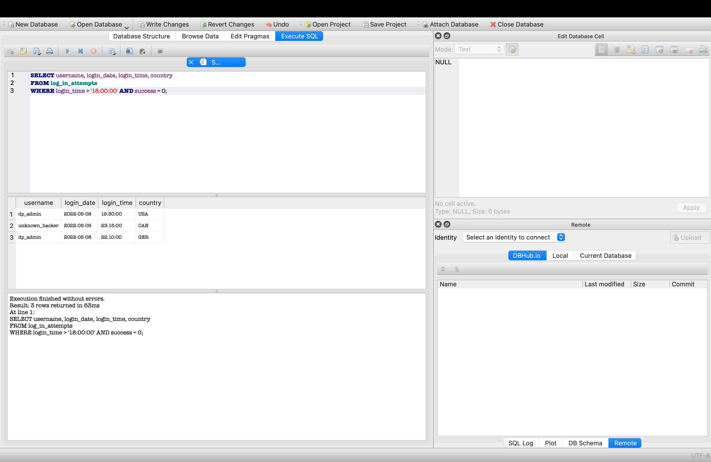
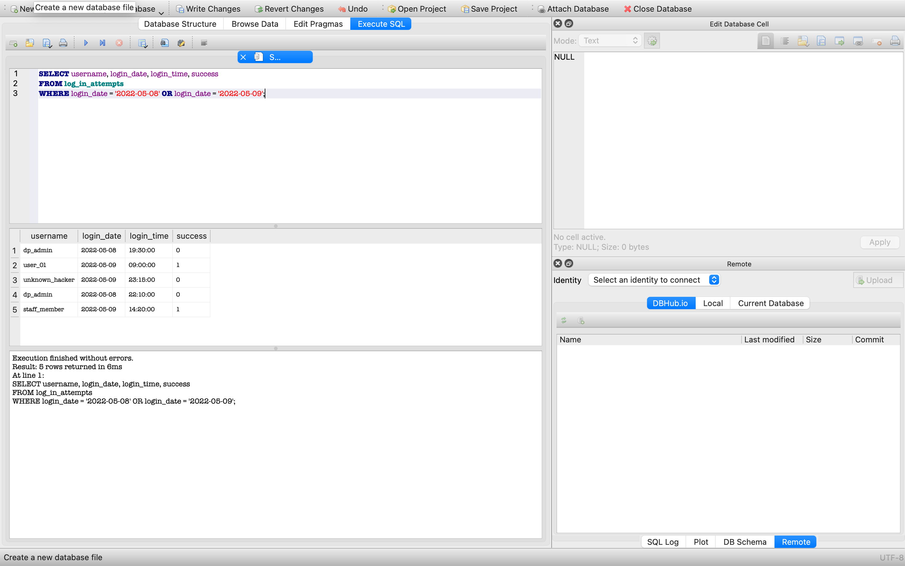
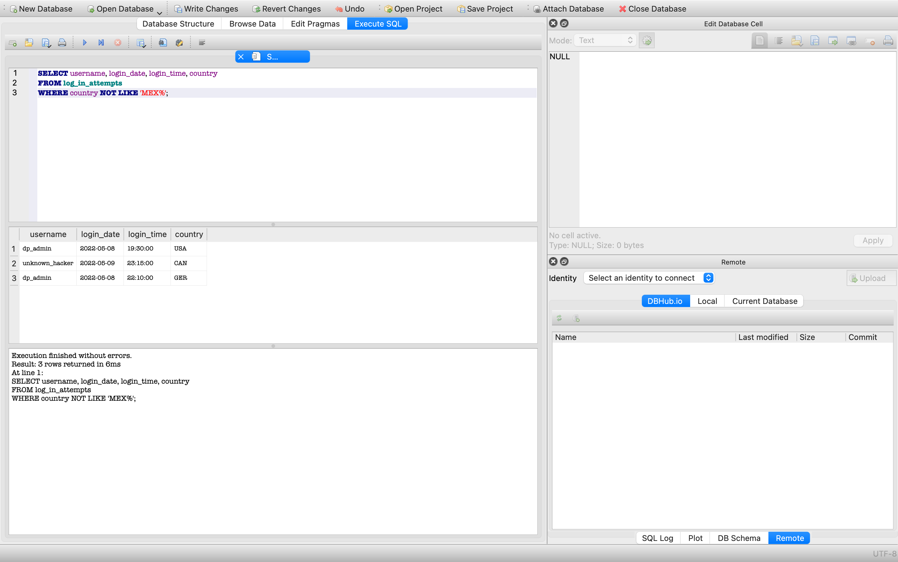
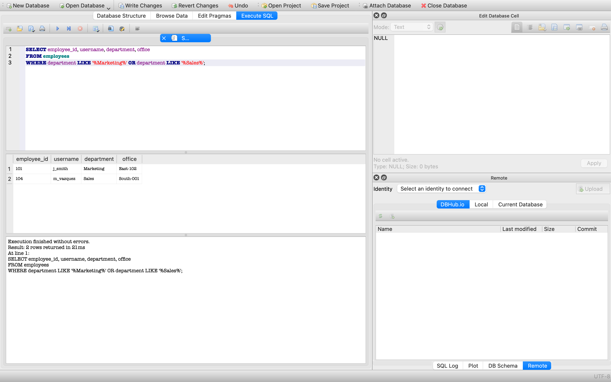

# Apply Filters to SQL Queries

**Author:** Dariusz Piasecki  
**Project:** SQL Security Analysis & Database Investigation

---

## Project Description

In this project, I act as a **security professional** tasked with investigating potential security incidents within a large organization. I use SQL queries to analyze data from the `log_in_attempts` and `employees` tables, focusing on:

- Failed login attempts occurring after business hours
- Suspicious activities during specific time windows
- Geographic anomalies in login origins
- Identifying employees in specific departments or locations

This analysis helps enhance the organization's security posture by pinpointing potential vulnerabilities and enabling proactive threat detection.

---

## Database Schema

The investigation uses data from two tables in the organization's security database.

### Table 1: `log_in_attempts`

This table records all login attempts with timestamps and geographic information.

**Columns visible in the analysis:**
- `username` – User account attempting login
- `login_date` – Date of the login attempt
- `login_time` – Time of the login attempt  
- `country` – Country code where login originated (USA, CAN, GER, MEX)
- `success` – Result of login attempt (0 = failed, 1 = successful)

### Table 2: `employees`

This table contains employee records and organizational assignments.

**Columns visible in the analysis:**
- `employee_id` – Unique employee identifier
- `username` – Employee's account name
- `department` – Assigned department (Marketing, Sales, etc.)
- `office` – Office location code (e.g., East-102, South-001)

---

## Investigation Tasks

### 1. Retrieve After-Hours Failed Login Attempts

**Objective:** Identify unauthorized access attempts occurring **after business hours (18:00)**.

To retrieve failed login attempts that occurred after business hours, I query the `log_in_attempts` table and apply a filter on the `login_time` column. I check for login attempts where the `success` column is `0` (indicating a failure) and the `login_time` is greater than `18:00:00`.

**SQL Query:**
```sql
SELECT username, login_date, login_time, country
FROM log_in_attempts
WHERE login_time > '18:00:00' AND success = 0;
```

**Results:**



**Key Findings:**
- **3 failed login attempts** detected after 18:00
- Targeted accounts: `dp_admin` (2 attempts), `unknown_hacker` (1 attempt)
- Geographic origins: USA, Canada, Germany
- **Security Concern:** Potential brute-force attacks on administrative accounts during off-hours

---

### 2. Retrieve Login Attempts on Specific Dates

**Objective:** Investigate all login attempts during a **suspected breach window (May 8-9, 2022)**.

To investigate suspicious activity during specific dates, I query the `log_in_attempts` table and filter for login attempts that occurred on `2022-05-08` or `2022-05-09`. This helps identify patterns during a critical time window.

**SQL Query:**
```sql
SELECT username, login_date, login_time, success
FROM log_in_attempts
WHERE login_date = '2022-05-08' OR login_date = '2022-05-09';
```

**Results:**



**Key Findings:**
- **5 login attempts** recorded during the suspected breach period
- Mixed success/failure patterns indicating reconnaissance activity
- Affected accounts: `dp_admin`, `user_01`, `unknown_hacker`, `staff_member`
- Timeline spans from 09:00 to 23:15, suggesting sustained malicious activity

---

### 3. Retrieve Login Attempts Outside of Mexico

**Objective:** Filter login attempts originating from **outside Mexico** (expected operational region).

To identify login attempts from unexpected geographic locations, I query the `log_in_attempts` table and filter for countries that do **not** match the pattern `'MEX%'` (Mexico and its variations). This helps detect potential unauthorized access from foreign locations.

**SQL Query:**
```sql
SELECT username, login_date, login_time, country
FROM log_in_attempts
WHERE country NOT LIKE 'MEX%';
```

**Results:**



**Key Findings:**
- **3 login attempts** from non-Mexico locations
- Detected countries: USA, Canada, Germany
- **Security Concern:** Potential policy violations or compromised accounts accessing from unauthorized regions
- **Recommendation:** Implement geo-blocking or multi-factor authentication for non-Mexico IP addresses

---

### 4. Retrieve Employees in Marketing and Sales Departments

**Objective:** Identify employees in **specific high-risk departments (Marketing & Sales)** for access re-validation.

To audit employee access, I query the `employees` table and filter for employees whose `department` column matches `'%Marketing%'` or `'%Sales%'`. This helps ensure that employees in sensitive departments have appropriate access controls.

**SQL Query:**
```sql
SELECT employee_id, username, department, office
FROM employees
WHERE department LIKE '%Marketing%' OR department LIKE '%Sales%';
```

**Results:**



**Key Findings:**
- **2 employees** identified in targeted departments
- Employee 101: `l_smith` (Marketing, East-102)
- Employee 104: `m_vasquez` (Sales, South-001)
- **Action Required:** Verify recent access logs for these accounts and apply least-privilege principles

---

## Summary

By applying SQL filters, I successfully isolated high-risk security events:

**1. After-Hours Monitoring**  
Detected 3 failed login attempts during non-business hours, indicating potential brute-force attacks on administrative accounts.

**2. Temporal Analysis**  
Identified 5 suspicious login attempts during a critical 48-hour suspected breach window.

**3. Geographic Anomalies**  
Found 3 login attempts from unexpected countries (USA, CAN, GER), violating geofencing policies.

**4. Department Audit**  
Located 2 employees in high-risk departments (Marketing, Sales) requiring access review.

---

## Key Takeaways

This systematic approach allows security teams to:

✅ **Reduce noise** in large datasets by filtering out routine activities  
✅ **Identify patterns** of suspicious behavior (e.g., multiple failures on admin accounts)  
✅ **Audit access** to ensure employees are in their correctly assigned departments  
✅ **Enable proactive monitoring** by detecting threats before they escalate  

---

## Security Recommendations

Based on this analysis, I recommend the following security measures:

| Priority | Recommendation | Implementation |
|----------|----------------|----------------|
| 🔴 **HIGH** | Implement IP-based geo-blocking for non-Mexico login attempts | Configure firewall rules to restrict access from unexpected regions |
| 🔴 **HIGH** | Enable multi-factor authentication (MFA) for administrative accounts | Deploy MFA solution (e.g., Google Authenticator, Duo Security) |
| 🟡 **MEDIUM** | Configure automated alerts for after-hours failed login attempts | Set up SIEM alerts for login failures outside business hours |
| 🟡 **MEDIUM** | Conduct quarterly access reviews for Marketing and Sales departments | Schedule regular audits to verify employee access permissions |
| 🟢 **LOW** | Establish rate-limiting on login endpoints | Implement login attempt throttling to prevent brute-force attacks |

---

## Tools & Technologies

| Category | Tool/Technology | Purpose |
|----------|----------------|---------|
| **Database** | SQLite | Lightweight relational database management system |
| **SQL Client** | DB Browser for SQLite | Visual tool for database queries and management |
| **Query Language** | SQL (Structured Query Language) | Data retrieval and manipulation |
| **Analysis Techniques** | Data filtering, pattern recognition, temporal analysis | Security incident investigation |

---

## Skills Demonstrated

| Skill Category | Specific Skills |
|----------------|-----------------|
| **SQL Proficiency** | Query construction with `WHERE`, `AND`, `OR`, `LIKE`, `NOT LIKE` operators |
| **Security Analysis** | Incident investigation, threat detection, vulnerability assessment |
| **Data Analysis** | Pattern recognition in security logs, temporal analysis, anomaly detection |
| **Documentation** | Professional technical reporting, clear communication of findings |
| **Tools Expertise** | DB Browser for SQLite, SQL query optimization, database management |

---

## Contact

**Dariusz Piasecki**  
📧 Email: d.piasecki@piaseckiphotos.com  
🔗 LinkedIn: [linkedin.com/in/piaseckiphotos](https://linkedin.com/in/piaseckiphotos)  
🐙 GitHub: [github.com/DariuszPiasecki](https://github.com/DariuszPiasecki)

---

*This analysis is a crucial part of incident response and proactive security monitoring, demonstrating practical SQL skills in a cybersecurity context.*
